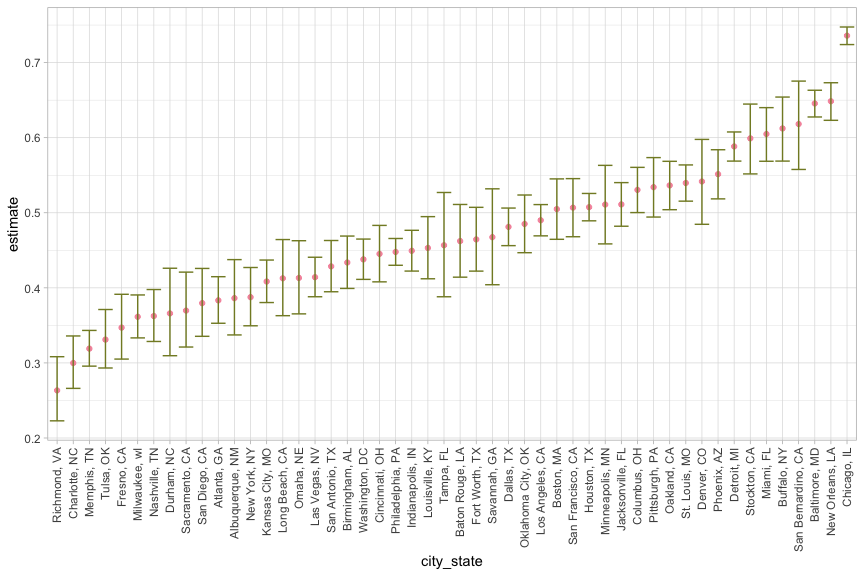

p8105_hm5_cx2257
================
Congyang Xie
11/19/2021

``` r
# library

library(tidyverse)
library(readr)
```

# Problem 1

1.  Describe the raw data. Create a city_state variable
    (e.g. “Baltimore, MD”) and then summarize within cities to obtain
    the total number of homicides and the number of unsolved homicides
    (those for which the disposition is “Closed without arrest” or
    “Open/No arrest”).

``` r
# describe raw data
homicide_raw <- read_csv("homicide-data.csv", na = c("", "Unknown"))
```

    ## Rows: 52179 Columns: 12

    ## ── Column specification ────────────────────────────────────────────────────────
    ## Delimiter: ","
    ## chr (8): uid, victim_last, victim_first, victim_race, victim_sex, city, stat...
    ## dbl (4): reported_date, victim_age, lat, lon

    ## 
    ## ℹ Use `spec()` to retrieve the full column specification for this data.
    ## ℹ Specify the column types or set `show_col_types = FALSE` to quiet this message.

``` r
skimr::skim(homicide_raw)
```

|                                                  |              |
|:-------------------------------------------------|:-------------|
| Name                                             | homicide_raw |
| Number of rows                                   | 52179        |
| Number of columns                                | 12           |
| \_\_\_\_\_\_\_\_\_\_\_\_\_\_\_\_\_\_\_\_\_\_\_   |              |
| Column type frequency:                           |              |
| character                                        | 8            |
| numeric                                          | 4            |
| \_\_\_\_\_\_\_\_\_\_\_\_\_\_\_\_\_\_\_\_\_\_\_\_ |              |
| Group variables                                  | None         |

Data summary

**Variable type: character**

| skim_variable | n_missing | complete_rate | min | max | empty | n_unique | whitespace |
|:--------------|----------:|--------------:|----:|----:|------:|---------:|-----------:|
| uid           |         0 |          1.00 |   9 |  10 |     0 |    52179 |          0 |
| victim_last   |      5764 |          0.89 |   1 |  20 |     0 |    12686 |          0 |
| victim_first  |      5762 |          0.89 |   1 |  28 |     0 |    16639 |          0 |
| victim_race   |      4199 |          0.92 |   5 |   8 |     0 |        5 |          0 |
| victim_sex    |      4231 |          0.92 |   4 |   6 |     0 |        2 |          0 |
| city          |         0 |          1.00 |   5 |  14 |     0 |       50 |          0 |
| state         |         0 |          1.00 |   2 |   2 |     0 |       28 |          0 |
| disposition   |         0 |          1.00 |  14 |  21 |     0 |        3 |          0 |

**Variable type: numeric**

| skim_variable | n_missing | complete_rate |        mean |         sd |          p0 |         p25 |         p50 |         p75 |          p100 | hist  |
|:--------------|----------:|--------------:|------------:|-----------:|------------:|------------:|------------:|------------:|--------------:|:------|
| reported_date |         0 |          1.00 | 20130899.16 | 1123419.63 | 20070101.00 | 20100318.00 | 20121216.00 | 20150911.00 | 201511105\.00 | ▇▁▁▁▁ |
| victim_age    |      2999 |          0.94 |       31.80 |      14.42 |        0.00 |       22.00 |       28.00 |       40.00 |        102.00 | ▃▇▃▁▁ |
| lat           |        60 |          1.00 |       37.03 |       4.35 |       25.73 |       33.77 |       38.52 |       40.03 |         45.05 | ▁▅▅▇▅ |
| lon           |        60 |          1.00 |      -91.47 |      13.75 |     -122.51 |      -96.00 |      -87.71 |      -81.76 |        -71.01 | ▃▁▃▇▅ |

``` r
# create variable "city_state"

homicide_df <- 
  homicide_raw %>% 
  mutate(
    city_state = str_c(city, ", ", state),
    resolution = case_when(
      disposition == "Closed by arrest" ~ "Solved",
      disposition == "Closed without arrest" ~ "Unsolved",
      disposition == "Open/No arrest" ~ "Unsolved"
    )) %>% 
  filter(city_state != "Tulsa, AL") %>% 
  relocate(city_state)
```

``` r
homicide_summary <-
  homicide_df %>% 
  group_by(city_state) %>% 
  summarise(unsolved = sum(resolution == "Unsolved"),
            total = n())
```

2.  For the city of Baltimore, MD, use the prop.test function to
    estimate the proportion of homicides that are unsolved; save the
    output of prop.test as an R object, apply the broom::tidy to this
    object and pull the estimated proportion and confidence intervals
    from the resulting tidy dataframe.

``` r
baltimore_summary <-
  homicide_summary %>%
  filter(city_state == "Baltimore, MD")

baltimore_prop <-
  prop.test(x = baltimore_summary %>% pull(unsolved),
            n = baltimore_summary %>% pull(total)) %>% 
  broom::tidy()

baltimore_prop_est <- 
  baltimore_prop %>% 
  pull(estimate)

baltimore_CI <-
  c(pull(baltimore_prop, conf.low), pull(baltimore_prop, conf.high))
```

3.  Now run prop.test for each of the cities in your dataset, and
    extract both the proportion of unsolved homicides and the confidence
    interval for each. Do this within a “tidy” pipeline, making use of
    purrr::map, purrr::map2, list columns and unnest as necessary to
    create a tidy dataframe with estimated proportions and CIs for each
    city.

``` r
prop_test_fun = function(city_df) {
  city_summary <-
    city_df %>%
    summarize(unsolved = sum(resolution == "Unsolved"),
              total = n())
  
  city_prop_test <-
    prop.test(x = city_summary %>% pull(unsolved),
              n = city_summary %>% pull(total)) %>%
    broom::tidy() %>%
    select(estimate, conf.low, conf.high)
  
  return(city_prop_test)
}
```

``` r
city_test <-
  nest(homicide_df, uid:resolution) %>%
  mutate(test_result = purrr::map(pull(.,data), prop_test_fun))
```

4.  Create a plot that shows the estimates and CIs for each city – check
    out geom_errorbar for a way to add error bars based on the upper and
    lower limits. Organize cities according to the proportion of
    unsolved homicides.

``` r
city_test %>% 
  select(-data) %>% 
  unnest() %>% 
  mutate(city_state = fct_reorder(city_state, estimate)) %>% 
  ggplot(aes(x = city_state, y = estimate)) +
  geom_point(color = "#F596AA") + 
  geom_errorbar(aes(ymin = conf.low, ymax = conf.high), color = "#838A2D") +
  theme_light() +
  theme(axis.text.x = element_text(angle = 90, vjust = 0.5, hjust = 1))
```

    ## Warning: `cols` is now required when using unnest().
    ## Please use `cols = c(test_result)`

<!-- -->

# Problem 2

Create a tidy dataframe containing data from all participants, including
the subject ID, arm, and observations over time:

``` r
participant_df <-
  tibble(
    file = list.files("data")
  )

setwd('data')
participant_df <-
  participant_df %>%
  mutate(data = purrr::map(pull(., file), read_csv)) %>%
  unnest() %>% 
  #separate(file, into = c("arm", "id"), sep = "_") %>% 
  mutate(id = substr(file, 1, 6),
         arm = substr(file, 1, 3)) %>% 
  select(-file) %>% 
  pivot_longer(week_1: week_8, values_to = "value", names_to = "week", names_prefix = "week_") %>% 
  relocate(arm, id)
```

``` r
participant_df %>%
  ggplot(aes(x = week, y = value)) +
  geom_line(aes(group = id, color = arm)) +
  theme_light() +
  scale_color_manual(
    values = c("#F596AA", "#838A2D"),
    name = "Arm",
    labels = c("Control", "Treatment")
  )
```

<!-- -->

-   As the trial goes on, the subjects in treatment group have generally
    greater value of interest.

# Problem 3

-   For numeric variables, you should fill in missing values with the
    mean of non-missing values
-   For character variables, you should fill in missing values with
    “virginica”

``` r
set.seed(10)

iris_with_missing = iris %>% 
  map_df(~replace(.x, sample(1:150, 20), NA)) %>%
  mutate(Species = as.character(Species))
```

``` r
missing_filler <- function(vec) {
    
  if (is_numeric(vec)) {
    vec = replace_na(vec, mean(vec, na.rm = TRUE))
  }

  if (is_character(vec)) {
    vec = replace_na(vec, "virginica")
  }
  
  return(vec)
}

iris_filled <-
  map(iris_with_missing, missing_filler) %>%
  bind_cols()

iris_filled %>% knitr::kable()  
```

| Sepal.Length | Sepal.Width | Petal.Length | Petal.Width | Species    |
|-------------:|------------:|-------------:|------------:|:-----------|
|     5.100000 |    3.500000 |     1.400000 |    0.200000 | setosa     |
|     4.900000 |    3.000000 |     1.400000 |    0.200000 | setosa     |
|     4.700000 |    3.200000 |     1.300000 |    0.200000 | setosa     |
|     4.600000 |    3.100000 |     1.500000 |    1.192308 | setosa     |
|     5.000000 |    3.600000 |     1.400000 |    0.200000 | setosa     |
|     5.400000 |    3.900000 |     1.700000 |    0.400000 | setosa     |
|     5.819231 |    3.400000 |     1.400000 |    0.300000 | setosa     |
|     5.000000 |    3.400000 |     1.500000 |    0.200000 | setosa     |
|     4.400000 |    2.900000 |     1.400000 |    0.200000 | setosa     |
|     4.900000 |    3.100000 |     3.765385 |    0.100000 | setosa     |
|     5.400000 |    3.075385 |     1.500000 |    0.200000 | setosa     |
|     4.800000 |    3.400000 |     1.600000 |    0.200000 | setosa     |
|     5.819231 |    3.075385 |     1.400000 |    0.100000 | setosa     |
|     4.300000 |    3.000000 |     3.765385 |    0.100000 | setosa     |
|     5.819231 |    4.000000 |     3.765385 |    0.200000 | setosa     |
|     5.700000 |    4.400000 |     1.500000 |    0.400000 | setosa     |
|     5.400000 |    3.900000 |     1.300000 |    0.400000 | setosa     |
|     5.100000 |    3.500000 |     1.400000 |    1.192308 | setosa     |
|     5.700000 |    3.800000 |     1.700000 |    0.300000 | setosa     |
|     5.100000 |    3.800000 |     1.500000 |    1.192308 | setosa     |
|     5.400000 |    3.400000 |     1.700000 |    0.200000 | setosa     |
|     5.100000 |    3.700000 |     1.500000 |    0.400000 | virginica  |
|     4.600000 |    3.600000 |     1.000000 |    0.200000 | setosa     |
|     5.819231 |    3.300000 |     3.765385 |    0.500000 | setosa     |
|     4.800000 |    3.400000 |     1.900000 |    0.200000 | virginica  |
|     5.000000 |    3.000000 |     3.765385 |    0.200000 | setosa     |
|     5.000000 |    3.400000 |     1.600000 |    0.400000 | virginica  |
|     5.200000 |    3.500000 |     1.500000 |    0.200000 | setosa     |
|     5.819231 |    3.400000 |     1.400000 |    0.200000 | setosa     |
|     4.700000 |    3.200000 |     1.600000 |    0.200000 | setosa     |
|     4.800000 |    3.100000 |     3.765385 |    0.200000 | setosa     |
|     5.400000 |    3.075385 |     1.500000 |    0.400000 | setosa     |
|     5.200000 |    3.075385 |     1.500000 |    0.100000 | setosa     |
|     5.500000 |    4.200000 |     1.400000 |    0.200000 | setosa     |
|     4.900000 |    3.100000 |     3.765385 |    0.200000 | setosa     |
|     5.000000 |    3.200000 |     1.200000 |    0.200000 | setosa     |
|     5.500000 |    3.500000 |     1.300000 |    0.200000 | setosa     |
|     4.900000 |    3.600000 |     1.400000 |    0.100000 | setosa     |
|     4.400000 |    3.000000 |     1.300000 |    1.192308 | setosa     |
|     5.100000 |    3.400000 |     1.500000 |    0.200000 | setosa     |
|     5.000000 |    3.500000 |     1.300000 |    0.300000 | setosa     |
|     4.500000 |    3.075385 |     1.300000 |    1.192308 | virginica  |
|     4.400000 |    3.200000 |     1.300000 |    0.200000 | setosa     |
|     5.000000 |    3.500000 |     1.600000 |    0.600000 | setosa     |
|     5.100000 |    3.800000 |     1.900000 |    0.400000 | setosa     |
|     4.800000 |    3.000000 |     1.400000 |    0.300000 | virginica  |
|     5.100000 |    3.800000 |     1.600000 |    0.200000 | setosa     |
|     4.600000 |    3.200000 |     3.765385 |    0.200000 | setosa     |
|     5.300000 |    3.700000 |     1.500000 |    0.200000 | setosa     |
|     5.000000 |    3.075385 |     1.400000 |    0.200000 | setosa     |
|     7.000000 |    3.075385 |     4.700000 |    1.400000 | virginica  |
|     6.400000 |    3.200000 |     4.500000 |    1.500000 | versicolor |
|     6.900000 |    3.100000 |     4.900000 |    1.500000 | versicolor |
|     5.500000 |    2.300000 |     4.000000 |    1.300000 | versicolor |
|     6.500000 |    2.800000 |     4.600000 |    1.500000 | versicolor |
|     5.700000 |    2.800000 |     4.500000 |    1.300000 | versicolor |
|     6.300000 |    3.300000 |     4.700000 |    1.600000 | virginica  |
|     4.900000 |    2.400000 |     3.765385 |    1.000000 | versicolor |
|     6.600000 |    2.900000 |     4.600000 |    1.300000 | virginica  |
|     5.200000 |    2.700000 |     3.900000 |    1.400000 | versicolor |
|     5.000000 |    2.000000 |     3.765385 |    1.000000 | versicolor |
|     5.900000 |    3.000000 |     4.200000 |    1.500000 | versicolor |
|     6.000000 |    2.200000 |     4.000000 |    1.192308 | versicolor |
|     6.100000 |    2.900000 |     4.700000 |    1.400000 | versicolor |
|     5.600000 |    2.900000 |     3.600000 |    1.300000 | versicolor |
|     6.700000 |    3.100000 |     4.400000 |    1.400000 | versicolor |
|     5.600000 |    3.000000 |     4.500000 |    1.500000 | versicolor |
|     5.800000 |    3.075385 |     4.100000 |    1.000000 | versicolor |
|     6.200000 |    2.200000 |     4.500000 |    1.500000 | versicolor |
|     5.600000 |    2.500000 |     3.900000 |    1.100000 | versicolor |
|     5.900000 |    3.200000 |     4.800000 |    1.800000 | versicolor |
|     5.819231 |    2.800000 |     4.000000 |    1.300000 | virginica  |
|     6.300000 |    2.500000 |     4.900000 |    1.500000 | versicolor |
|     5.819231 |    2.800000 |     3.765385 |    1.200000 | versicolor |
|     6.400000 |    2.900000 |     4.300000 |    1.300000 | versicolor |
|     6.600000 |    3.000000 |     4.400000 |    1.400000 | versicolor |
|     6.800000 |    2.800000 |     4.800000 |    1.400000 | versicolor |
|     6.700000 |    3.075385 |     5.000000 |    1.192308 | versicolor |
|     6.000000 |    3.075385 |     4.500000 |    1.192308 | versicolor |
|     5.700000 |    2.600000 |     3.500000 |    1.000000 | virginica  |
|     5.500000 |    2.400000 |     3.800000 |    1.100000 | versicolor |
|     5.819231 |    2.400000 |     3.700000 |    1.000000 | versicolor |
|     5.800000 |    2.700000 |     3.900000 |    1.200000 | versicolor |
|     6.000000 |    2.700000 |     5.100000 |    1.600000 | versicolor |
|     5.400000 |    3.000000 |     4.500000 |    1.500000 | versicolor |
|     5.819231 |    3.400000 |     4.500000 |    1.600000 | versicolor |
|     6.700000 |    3.100000 |     4.700000 |    1.192308 | versicolor |
|     5.819231 |    3.075385 |     4.400000 |    1.300000 | versicolor |
|     5.600000 |    3.000000 |     3.765385 |    1.192308 | versicolor |
|     5.500000 |    2.500000 |     4.000000 |    1.192308 | versicolor |
|     5.500000 |    3.075385 |     4.400000 |    1.200000 | versicolor |
|     5.819231 |    3.075385 |     4.600000 |    1.192308 | versicolor |
|     5.800000 |    3.075385 |     4.000000 |    1.192308 | versicolor |
|     5.000000 |    2.300000 |     3.300000 |    1.192308 | virginica  |
|     5.819231 |    2.700000 |     4.200000 |    1.300000 | versicolor |
|     5.700000 |    3.000000 |     4.200000 |    1.200000 | versicolor |
|     5.700000 |    2.900000 |     4.200000 |    1.300000 | versicolor |
|     6.200000 |    2.900000 |     4.300000 |    1.300000 | versicolor |
|     5.100000 |    2.500000 |     3.000000 |    1.192308 | versicolor |
|     5.700000 |    2.800000 |     4.100000 |    1.300000 | virginica  |
|     6.300000 |    3.075385 |     3.765385 |    2.500000 | virginica  |
|     5.800000 |    2.700000 |     5.100000 |    1.900000 | virginica  |
|     7.100000 |    3.000000 |     5.900000 |    2.100000 | virginica  |
|     6.300000 |    2.900000 |     5.600000 |    1.800000 | virginica  |
|     6.500000 |    3.075385 |     5.800000 |    2.200000 | virginica  |
|     7.600000 |    3.000000 |     6.600000 |    2.100000 | virginica  |
|     4.900000 |    2.500000 |     4.500000 |    1.700000 | virginica  |
|     7.300000 |    2.900000 |     6.300000 |    1.800000 | virginica  |
|     6.700000 |    3.075385 |     3.765385 |    1.800000 | virginica  |
|     5.819231 |    3.600000 |     3.765385 |    2.500000 | virginica  |
|     6.500000 |    3.200000 |     5.100000 |    2.000000 | virginica  |
|     5.819231 |    2.700000 |     5.300000 |    1.900000 | virginica  |
|     6.800000 |    3.000000 |     5.500000 |    2.100000 | virginica  |
|     5.700000 |    3.075385 |     5.000000 |    2.000000 | virginica  |
|     5.800000 |    2.800000 |     5.100000 |    2.400000 | virginica  |
|     6.400000 |    3.200000 |     5.300000 |    2.300000 | virginica  |
|     6.500000 |    3.000000 |     3.765385 |    1.800000 | virginica  |
|     7.700000 |    3.800000 |     6.700000 |    1.192308 | virginica  |
|     7.700000 |    2.600000 |     6.900000 |    2.300000 | virginica  |
|     6.000000 |    2.200000 |     5.000000 |    1.500000 | virginica  |
|     5.819231 |    3.200000 |     5.700000 |    1.192308 | virginica  |
|     5.600000 |    3.075385 |     4.900000 |    2.000000 | virginica  |
|     7.700000 |    2.800000 |     6.700000 |    2.000000 | virginica  |
|     6.300000 |    2.700000 |     4.900000 |    1.800000 | virginica  |
|     6.700000 |    3.300000 |     5.700000 |    2.100000 | virginica  |
|     7.200000 |    3.200000 |     6.000000 |    1.800000 | virginica  |
|     6.200000 |    2.800000 |     4.800000 |    1.800000 | virginica  |
|     6.100000 |    3.000000 |     4.900000 |    1.800000 | virginica  |
|     6.400000 |    2.800000 |     5.600000 |    2.100000 | virginica  |
|     7.200000 |    3.000000 |     5.800000 |    1.600000 | virginica  |
|     7.400000 |    2.800000 |     6.100000 |    1.192308 | virginica  |
|     7.900000 |    3.800000 |     3.765385 |    2.000000 | virginica  |
|     6.400000 |    2.800000 |     3.765385 |    2.200000 | virginica  |
|     5.819231 |    2.800000 |     5.100000 |    1.500000 | virginica  |
|     6.100000 |    3.075385 |     5.600000 |    1.400000 | virginica  |
|     5.819231 |    3.000000 |     6.100000 |    2.300000 | virginica  |
|     5.819231 |    3.400000 |     5.600000 |    1.192308 | virginica  |
|     6.400000 |    3.100000 |     5.500000 |    1.192308 | virginica  |
|     6.000000 |    3.000000 |     4.800000 |    1.800000 | virginica  |
|     6.900000 |    3.100000 |     5.400000 |    2.100000 | virginica  |
|     6.700000 |    3.100000 |     5.600000 |    2.400000 | virginica  |
|     6.900000 |    3.100000 |     5.100000 |    2.300000 | virginica  |
|     5.819231 |    2.700000 |     5.100000 |    1.900000 | virginica  |
|     6.800000 |    3.200000 |     3.765385 |    2.300000 | virginica  |
|     6.700000 |    3.300000 |     3.765385 |    2.500000 | virginica  |
|     6.700000 |    3.000000 |     5.200000 |    2.300000 | virginica  |
|     6.300000 |    2.500000 |     5.000000 |    1.900000 | virginica  |
|     6.500000 |    3.000000 |     5.200000 |    2.000000 | virginica  |
|     5.819231 |    3.400000 |     5.400000 |    2.300000 | virginica  |
|     5.900000 |    3.000000 |     5.100000 |    1.800000 | virginica  |
