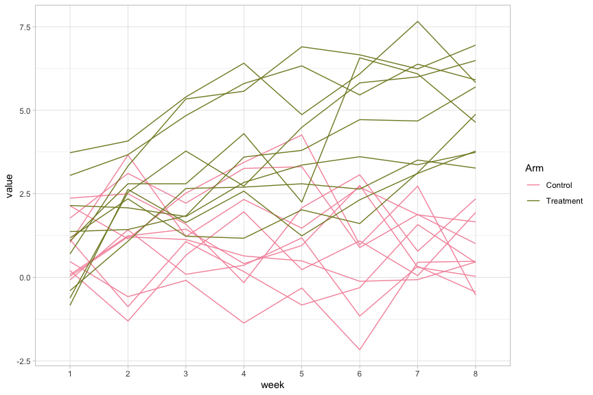

p8105_hm5_cx2257
================
Congyang Xie
11/19/2021

``` r
# library

library(tidyverse)
library(readr)
```

# Problem 1

1.  Describe the raw data. Create a city_state variable
    (e.g. “Baltimore, MD”) and then summarize within cities to obtain
    the total number of homicides and the number of unsolved homicides
    (those for which the disposition is “Closed without arrest” or
    “Open/No arrest”).

``` r
# describe raw data
homicide_raw <- read_csv("homicide-data.csv", na = c("", "Unknown"))
```

    ## Rows: 52179 Columns: 12

    ## ── Column specification ────────────────────────────────────────────────────────
    ## Delimiter: ","
    ## chr (8): uid, victim_last, victim_first, victim_race, victim_sex, city, stat...
    ## dbl (4): reported_date, victim_age, lat, lon

    ## 
    ## ℹ Use `spec()` to retrieve the full column specification for this data.
    ## ℹ Specify the column types or set `show_col_types = FALSE` to quiet this message.

``` r
skimr::skim(homicide_raw)
```

|                                                  |              |
|:-------------------------------------------------|:-------------|
| Name                                             | homicide_raw |
| Number of rows                                   | 52179        |
| Number of columns                                | 12           |
| \_\_\_\_\_\_\_\_\_\_\_\_\_\_\_\_\_\_\_\_\_\_\_   |              |
| Column type frequency:                           |              |
| character                                        | 8            |
| numeric                                          | 4            |
| \_\_\_\_\_\_\_\_\_\_\_\_\_\_\_\_\_\_\_\_\_\_\_\_ |              |
| Group variables                                  | None         |

Data summary

**Variable type: character**

| skim_variable | n_missing | complete_rate | min | max | empty | n_unique | whitespace |
|:--------------|----------:|--------------:|----:|----:|------:|---------:|-----------:|
| uid           |         0 |          1.00 |   9 |  10 |     0 |    52179 |          0 |
| victim_last   |      5764 |          0.89 |   1 |  20 |     0 |    12686 |          0 |
| victim_first  |      5762 |          0.89 |   1 |  28 |     0 |    16639 |          0 |
| victim_race   |      4199 |          0.92 |   5 |   8 |     0 |        5 |          0 |
| victim_sex    |      4231 |          0.92 |   4 |   6 |     0 |        2 |          0 |
| city          |         0 |          1.00 |   5 |  14 |     0 |       50 |          0 |
| state         |         0 |          1.00 |   2 |   2 |     0 |       28 |          0 |
| disposition   |         0 |          1.00 |  14 |  21 |     0 |        3 |          0 |

**Variable type: numeric**

| skim_variable | n_missing | complete_rate |        mean |         sd |          p0 |         p25 |         p50 |         p75 |          p100 | hist  |
|:--------------|----------:|--------------:|------------:|-----------:|------------:|------------:|------------:|------------:|--------------:|:------|
| reported_date |         0 |          1.00 | 20130899.16 | 1123419.63 | 20070101.00 | 20100318.00 | 20121216.00 | 20150911.00 | 201511105\.00 | ▇▁▁▁▁ |
| victim_age    |      2999 |          0.94 |       31.80 |      14.42 |        0.00 |       22.00 |       28.00 |       40.00 |        102.00 | ▃▇▃▁▁ |
| lat           |        60 |          1.00 |       37.03 |       4.35 |       25.73 |       33.77 |       38.52 |       40.03 |         45.05 | ▁▅▅▇▅ |
| lon           |        60 |          1.00 |      -91.47 |      13.75 |     -122.51 |      -96.00 |      -87.71 |      -81.76 |        -71.01 | ▃▁▃▇▅ |

``` r
# create variable "city_state"

homicide_df <- 
  homicide_raw %>% 
  mutate(
    city_state = str_c(city, ", ", state),
    resolution = case_when(
      disposition == "Closed by arrest" ~ "Solved",
      disposition == "Closed without arrest" ~ "Unsolved",
      disposition == "Open/No arrest" ~ "Unsolved"
    )) %>% 
  filter(city_state != "Tulsa, AL") %>% 
  relocate(city_state)
```

``` r
homicide_summary <-
  homicide_df %>% 
  group_by(city_state) %>% 
  summarise(unsolved = sum(resolution == "Unsolved"),
            total = n())
```

2.  For the city of Baltimore, MD, use the prop.test function to
    estimate the proportion of homicides that are unsolved; save the
    output of prop.test as an R object, apply the broom::tidy to this
    object and pull the estimated proportion and confidence intervals
    from the resulting tidy dataframe.

``` r
baltimore_summary <-
  homicide_summary %>%
  filter(city_state == "Baltimore, MD")

baltimore_prop <-
  prop.test(x = baltimore_summary %>% pull(unsolved),
            n = baltimore_summary %>% pull(total)) %>% 
  broom::tidy()

baltimore_prop_est <- 
  baltimore_prop %>% 
  pull(estimate)

baltimore_CI <-
  c(pull(baltimore_prop, conf.low), pull(baltimore_prop, conf.high))
```

3.  Now run prop.test for each of the cities in your dataset, and
    extract both the proportion of unsolved homicides and the confidence
    interval for each. Do this within a “tidy” pipeline, making use of
    purrr::map, purrr::map2, list columns and unnest as necessary to
    create a tidy dataframe with estimated proportions and CIs for each
    city.

``` r
prop_test_fun = function(city_df) {
  city_summary <-
    city_df %>%
    summarize(unsolved = sum(resolution == "Unsolved"),
              total = n())
  
  city_prop_test <-
    prop.test(x = city_summary %>% pull(unsolved),
              n = city_summary %>% pull(total)) %>%
    broom::tidy() %>%
    select(estimate, conf.low, conf.high)
  
  return(city_prop_test)
}
```

``` r
city_test <-
  nest(homicide_df, uid:resolution) %>%
  mutate(test_result = purrr::map(pull(.,data), prop_test_fun))
```

4.  Create a plot that shows the estimates and CIs for each city – check
    out geom_errorbar for a way to add error bars based on the upper and
    lower limits. Organize cities according to the proportion of
    unsolved homicides.

``` r
city_test %>% 
  select(-data) %>% 
  unnest() %>% 
  mutate(city_state = fct_reorder(city_state, estimate)) %>% 
  ggplot(aes(x = city_state, y = estimate)) +
  geom_point() + 
  geom_errorbar(aes(ymin = conf.low, ymax = conf.high)) +
  theme(axis.text.x = element_text(angle = 90, vjust = 0.5, hjust = 1))
```

    ## Warning: `cols` is now required when using unnest().
    ## Please use `cols = c(test_result)`

<!-- -->

# Problem 2

Create a tidy dataframe containing data from all participants, including
the subject ID, arm, and observations over time:

``` r
participant_df <-
  tibble(
    file = list.files("data")
  )

setwd('data')
participant_df <-
  participant_df %>%
  mutate(data = purrr::map(pull(., file), read_csv)) %>%
  unnest() %>% 
  #separate(file, into = c("arm", "id"), sep = "_") %>% 
  mutate(id = substr(file, 1, 6),
         arm = substr(file, 1, 3)) %>% 
  select(-file) %>% 
  pivot_longer(week_1: week_8, values_to = "value", names_to = "week", names_prefix = "week_") %>% 
  relocate(arm, id)
```

``` r
participant_df %>%
  ggplot(aes(x = week, y = value)) +
  geom_line(aes(group = id, color = arm)) +
  viridis::scale_color_viridis(discrete = T) +
  theme_light()
```

<!-- -->

-   As the trial goes on, the subjects in treatment group have general
    greater value of interest.
